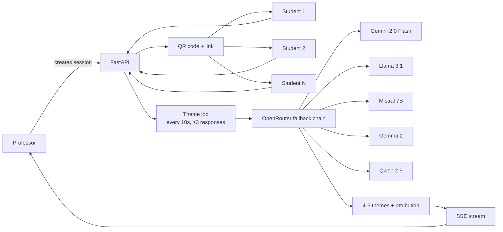

# ClassPulse

Live classroom theme extraction. Professors post a question, students answer via QR code, an LLM summarizes the responses into 4–6 themed cards in real time. FastAPI + SSE, 5-model OpenRouter fallback chain, single Railway service.

- **Live demo:** https://themepulse-production.up.railway.app/
- **Portfolio:** https://arjun-varma.com/
- **Built at:** Personal project · 2026

## Problem

In live classrooms, professors ask open-ended questions to gauge student understanding. Collecting and synthesizing dozens of responses in real time is impractical. Students hesitate to speak up; manual aggregation of written responses misses emerging themes.

Goal: professor poses a question, students submit instantly via QR or link, system summarizes responses into key themes with attribution — turning messy classroom input into actionable insights during the session.

## Challenge

- Aggregate and process submissions as they arrive without blocking the UI
- LLM summarization must run periodically (e.g. every 10 seconds) while new responses stream in
- 5-model fallback chain required to handle API rate limits and availability
- Single deployment (FastAPI + static React) to simplify Railway hosting
- QR code and shareable link flow must be frictionless for students on any device

## Approach

1. **Session creation** — professor creates a session with a question; system generates a unique QR code and shareable link
2. **Student submission** — students open the link (no signup), type their answer, submit
3. **Periodic summarization** — backend runs summarization every 10 seconds when ≥3 responses exist, using OpenRouter with a 5-model fallback chain
4. **Real-time updates** — FastAPI serves Server-Sent Events so the professor's dashboard updates automatically as new themes are generated

## Solution / Architecture



**Components:**

- **FastAPI backend** — REST API for sessions, responses, theme summaries; SSE endpoint for real-time dashboard
- **React / Vite frontend** — professor dashboard with theme cards + student attribution; student submission form with QR display
- **OpenRouter integration** — 5-model fallback chain (Gemini 2.0 Flash → Llama 3.1 → Mistral 7B → Gemma 2 → Qwen 2.5)
- **Single Dockerfile** — builds React static assets, runs FastAPI serving both API and static files
- **Railway deployment** — one service, auto-deploy on push, OpenRouter API key as Railway variable

## Impact / Results

- Live theme extraction from student responses in real time during class
- Reduces manual aggregation from minutes to seconds
- 5-model fallback ensures summarization works even when primary models are rate-limited
- Frictionless student flow — no signup, just scan and submit
- Deployed on Railway with CI/CD from GitHub pushes

## Tech Stack

Python · FastAPI · Server-Sent Events · React · TypeScript · Vite · OpenRouter API · Railway · Docker

## Run Locally

```bash
git clone https://github.com/ARJUNVARMA2000/ClassPulse.git
cd ClassPulse
cp .env.example .env   # add OPENROUTER_API_KEY
# backend
pip install -r requirements.txt
uvicorn api.main:app --reload
# frontend (separate terminal)
cd frontend && npm install && npm run dev
```

## License

MIT
