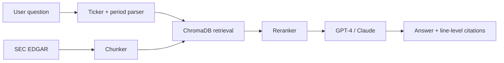

# Financial RAG Chatbot

LLM-powered RAG chatbot that answers company financial questions from SEC filings with line-level citations. No hallucinations, no "I think Q3 revenue was…" — every claim cites the source paragraph.

- **Live demo:** https://finrag-frontend-7pj7nolpla-uc.a.run.app/
- **Portfolio:** https://arjun-varma.com/
- **Built at:** Columbia University · Nov 2025 – Dec 2025

## Problem

Financial analysts and investors spend countless hours manually sifting through SEC filings (10-K, 10-Q, 8-K) to extract insights about company performance, risk factors, and management discussions. These documents are dense, often 100+ pages, and written in complex legal/financial language.

Standard LLM approaches hallucinate numbers and cite nothing. In a finance context, that's unusable. The goal: an intelligent assistant that answers natural language questions about company financials with accurate, source-grounded responses.

## Challenge

- SEC filings contain complex nested structures (tables, footnotes, cross-references)
- Financial data requires precise numerical accuracy — approximations are unacceptable
- Context windows are limited, but relevant information may span multiple document sections
- Need to handle both quantitative queries ("What was Q3 revenue?") and qualitative ones ("What are the main risk factors?")
- Responses must cite sources to maintain trust and auditability

## Approach

**Retrieval-Augmented Generation (RAG)** pipeline with several purpose-built layers:

1. **Document processing** — SEC EDGAR APIs fetch filings; intelligent chunking respects document structure (tables, section boundaries are preserved, not split)
2. **Semantic search** — ChromaDB vector store with `text-embedding-3-large` for retrieval; metadata filtering by company, filing date, section type
3. **Multi-stage retrieval** — initial broad retrieval, then reranking to surface the most relevant chunks for each query
4. **Prompt engineering** — prompts explicitly constrain the model to answer only from retrieved context and cite every claim

## Solution / Architecture



**Components:**

- **FastAPI backend** — REST API handling document ingestion, query processing, and response generation
- **Streamlit frontend** — interactive chat UI with conversation history and source highlighting
- **ChromaDB** — persistent vector store with company/filing metadata for filtered retrieval
- **LangChain orchestration** — manages the RAG pipeline, conversation memory, and chain-of-thought reasoning
- **Evaluation pipeline** — Claude Opus as a judge scores response accuracy, relevance, and faithfulness to source documents

## Impact / Results

- **Line-level citations** — every answer shows exactly which paragraph it came from
- **Claude Opus eval pipeline** — automatic scoring of response accuracy and relevance on a held-out Q&A set
- **Multi-year coverage** — integrated filings across several companies and years
- **Time-to-insight** — reduced from hours of manual reading to seconds of conversation
- **Auto ticker/period parsing** — users type "What was AAPL's Q3 2024 revenue?" and the system handles the rest
- **Deployed** — live on Streamlit Cloud with persistent conversation history

## Tech Stack

Python · FastAPI · ChromaDB · text-embedding-3-large · LangChain · Streamlit · GCP Cloud Run

## Run Locally

```bash
git clone https://github.com/ARJUNVARMA2000/Financial-RAG-Chatbot.git
cd Financial-RAG-Chatbot
cp .env.example .env   # add OPENAI_API_KEY, ANTHROPIC_API_KEY
pip install -r requirements.txt
# ingest filings
python -m scripts.ingest --tickers AAPL,MSFT,GOOGL
# run
uvicorn api.main:app --reload &
streamlit run app/streamlit_app.py
```

## License

MIT
